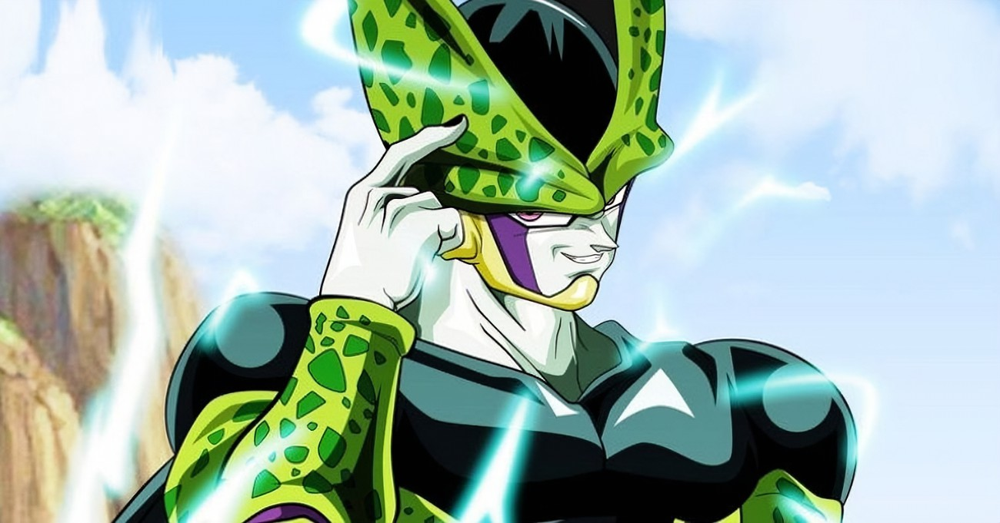

# **Projeto Escolha de Personagem**


Bem-vindo à aplicação de escolha de personagem! Esta aplicação foi criada com o objetivo de permitir que os usuários escolham o personagem de sua preferência entre uma lista de opções. Os personagens são apresentados em uma lista visual, onde o usuário pode passar o mouse sobre cada um para obter mais informações sobre ele. Ao selecionar o personagem, ele é destacado na tela e suas informações, incluindo imagem e nome, são exibidas na seção de jogador 1. Além disso, a aplicação possui a funcionalidade de impedir a seleção do personagem Freeza. Esta aplicação é fácil de usar e proporciona uma experiência de escolha de personagem divertida e intuitiva. Experimente agora e escolha seu personagem favorito!

## Para desenvolver essa aplicação de escolha de personagem, os seguintes requisitos devem ser considerados:

- Interface gráfica: a aplicação precisa ter uma interface fácil de usar, com uma lista visual de personagens e uma seção de jogador 1 para exibir as informações do personagem selecionado.
- Lógica de seleção: a aplicação precisa ser programada para permitir a seleção de um personagem e destacá-lo na tela, exibindo suas informações na seção de jogador 1.
- Restrição de seleção: a aplicação precisa ser programada para impedir a seleção do personagem Freeza.
- Testes: é importante realizar testes para garantir a funcionalidade da aplicação e corrigir possíveis bugs.

## Requisitos técnicos incluem:

- Conhecimento de HTML para estruturar a página e definir a estrutura de conteúdo.
- Conhecimento de CSS para estilizar a página e torná-la atrativa para o usuário.
- Conhecimento de JavaScript para adicionar interatividade à página, como a funcionalidade de seleção de personagem e exibição de informações.
- Conhecimento de DOM (Document Object Model) para manipular e atualizar elementos da página de acordo com ações do usuário.
- Conhecimento de boas práticas de programação, como organização do código e manutenção do código.

Além disso, um navegador web moderno e uma conexão à internet são requisitos básicos para que a aplicação possa ser acessada pelos usuários.

# Desenvolvimento:

##  **HTML**

## index.html

Este é o código HTML para uma página web chamada "Player Select". A página apresenta uma seleção de personagens de um jogo, permitindo que os jogadores escolham seus personagens para jogar.

A página tem um cabeçalho com o título "Player Select". Abaixo dele, há uma seção "seleção de personagens" que contém duas partes principais: uma imagem grande que mostra o personagem selecionado pelo jogador 1 e outra imagem grande que mostra o personagem selecionado pelo jogador 2.

A seleção de personagens em si é apresentada como uma lista de personagens, cada um representado por uma imagem. Cada personagem também tem uma tag indicando se ele é para o primeiro jogador (1P) ou para o segundo jogador (2P).

O código HTML inclui links para vários arquivos CSS, que são usados para estilizar a página. Além disso, há um arquivo JavaScript incluído na página, que será usado para implementar a funcionalidade da seleção de personagens.

```html
<!DOCTYPE html>
<html lang="en">
<head>
    <meta charset="UTF-8">
    <meta http-equiv="X-UA-Compatible" content="IE=edge">
    <meta name="viewport" content="width=device-width, initial-scale=1.0">
    <title>Marvel Dev Week</title>
    <link rel="stylesheet" href="./src/css/variaveis.css"/>
    <link rel="stylesheet" href="./src/css/reset.css"/>
    <link rel="stylesheet" href="./src/css/fontes.css"/>
    <link rel="stylesheet" href="./src/css/animacoes.css"/>
    <link rel="stylesheet" href="./src/css/estilos.css"/>
    <link rel="stylesheet" href="./src/css/responsivo.css">
</head>
<body>
    <main>
        <header class="cabecalho">
            <h1 class="titulo">
                Player Select
            </h1>
        </header>
        <div class="selecao-de-personagens">
            <div class="personagem-grande personagem-jogador-1">
                
                <div class="nome">
                    <h2 id ="nome-jogador-1">Majin boo</h2>
                </div>
            </div>
        
            <ul class="lista-de-personagens">
                <li class="personagem" id="vegeta" data-name="Vegeta">
                    <span class="tag">1P</span>
                    
                </li>

                <li class="personagem" id="cell" data-name="Cell">
                    <span class="tag">1P</span>
                    
                </li>

                <li class="personagem jogador-2-selecionado" id="freeza" data-name="Freeza">
                    <span class="tag">2P</span>
                    
                </li>

                <li class="personagem" id="mestre-kame" data-name="Mestre Kame">
                    <span class="tag">1P</span>
                    
                </li>

                <li class="personagem selecionado" id="boo" data-name="Majin boo">
                    <span class="tag">1P</span>
                    
                </li>

                <li class="personagem" id="goku" data-name="Goku">
                    <span class="tag">1P</span>
                    
                </li>

                <li class="personagem" id="trunks" data-name="Trunks">
                    <span class="tag">1P</span>
                    
                </li>

                <li class="personagem" id="gohan" data-name="Gohan">
                    <span class="tag">1P</span>
                    
                </li>

                <li class="personagem" id="picolo" data-name="Picolo">
                    <span class="tag">1P</span> 
                    
                </li>
            </ul>
            <div class="personagem-grande personagem-jogador-2">
                
                <div class="nome">
                    <h2>Freeza</h2>
                </div>
            </div>
        </div>
    </main>
    <script src="./src/js/index.js"></script>
</body>
</html>
```

# **CSS**

## reset.css

Este é um trecho de código CSS que define alguns estilos padrão para elementos HTML.

O primeiro conjunto de estilos redefine as propriedades padrão de margem, preenchimento, borda, tamanho da fonte, alinhamento vertical e dimensionamento de caixa para todos os elementos.
O segundo conjunto de estilos define a propriedade de estilo de lista de elementos de lista (ul) não ordenados como "nenhum", o que significa que os marcadores de lista (marcadores) não serão exibidos.

```css
* {
margin: 0;
padding: 0;
border: 0;
font-size: 100%;
vertical-align: baseline;
box-sizing: border-box;
}

ul {
    list-style: none;
}
```

## variaves.css

Este é um arquivo CSS que define variáveis personalizadas para cores usadas no design de um site. O arquivo declara 9 variáveis de cor diferentes, com nomes como --cor-vermelha-principal (cor vermelha primária), --cor-azul-fraca (cor azul fraca) e --cor-secundaria (cor secundária). Os nomes das variáveis estão em português, e o arquivo é chamado de "veriaveis.css".

```css
:root {
    --cor-vermelha-principal: #D60223;
    --cor-vermelha-media: #f89284;
    --cor-vermelha-fraca: #ffbebe;

    --cor-marrom-fraco: #ebd5d2;

    --cor-azul-principal: #0271F7;
    --cor-azul-media: #d3ffff;
    --cor-azul-fraca: #8fbff8;

    --cor-roxa-fraca: #c2c2f1;

    --cor-titulo-fraco: #faefd8;
    --cor-titulo-forte: #f77a2c;

    --cor-padrao: #ffffff;
    --cor-secundaria: #000000;
}
```

## fontes.css

Este arquivo se chama fontes.css e ele define as fontes usadas na página. As duas fontes incluídas são "ssf4" e "commad".

```css
@font-face {
    font-family: 'ssf4';
    src: url(../fontes/SSF4_ABUKET.woff);
}

@font-face {
    font-family: 'commad';
    src: url(../fontes/PILOT_COMMAND.otf);
}
```

## animacoes.css

Estas são animações de quadro-chave para CSS. As animações usam as propriedades box-shadow e text-shadow para criar um efeito brilhante para os elementos. Os quadros-chave definem os estados inicial e final da animação e a palavra-chave to especifica o estado final. As animações usam variáveis CSS (por exemplo, --cor-azul-fraca, --cor-marrom-fraco, etc.) para definir as cores usadas na animação.

```css
/* COMEÇO ANIMAÇÕES */
@keyframes c-glowing-blue {
    0% {
      box-shadow: 0 0 5px 
      var(--cor-azul-fraca), 0 0 5px 
      var(--cor-azul-fraca), 0 0 15px 
      var(--cor-azul-fraca), 0 0 20px 
      var(--cor-azul-principal), 0 0 10px 
      var(--cor-azul-principal), 0 0 10px 
      var(--cor-azul-principal), 0 0 10px 
      var(--cor-azul-principal), 0 0 10px 
      var(--cor-azul-principal)
    }
  
    to {
      box-shadow: 0 0 2.5px 
      var(--cor-azul-fraca), 0 0 2.5px 
      var(--cor-azul-fraca), 0 0 7.5px 
      var(--cor-azul-fraca), 0 0 10px 
      var(--cor-azul-principal), 0 0 5px 
      var(--cor-azul-principal), 0 0 5px 
      var(--cor-azul-principal), 0 0 5px 
      var(--cor-azul-principal), 0 0 2px 
      var(--cor-azul-principal)
    }
  }
  
  @keyframes c-glowing-red {
    0% {
      box-shadow: 0 0 5px 
      var(--cor-marrom-fraco), 0 0 5px 
      var(--cor-marrom-fraco), 0 0 15px 
      var(--cor-marrom-fraco), 0 0 20px 
      var(--cor-vermelha-principal), 0 0 10px 
      var(--cor-vermelha-principal), 0 0 10px 
      var(--cor-vermelha-principal), 0 0 10px 
      var(--cor-vermelha-principal), 0 0 10px 
      var(--cor-vermelha-principal)
    }
  
    to {
      box-shadow: 0 0 2.5px 
      var(--cor-marrom-fraco), 0 0 2.5px 
      var(--cor-marrom-fraco), 0 0 7.5px 
      var(--cor-marrom-fraco), 0 0 10px 
      var(--cor-vermelha-principal), 0 0 5px 
      var(--cor-vermelha-principal), 0 0 5px 
      var(--cor-vermelha-principal), 0 0 5px 
      var(--cor-vermelha-principal), 0 0 2px 
      var(--cor-vermelha-principal)
    }
  }
  
  @keyframes text-glowing-blue {
    0% {
      text-shadow: 0 0 1px 
      var(--cor-padrao), 0 0 1px 
      var(--cor-padrao), 0 0 1px 
      var(--cor-padrao), 0 0 1px 
      var(--cor-azul-media), 0 0 5px 
      var(--cor-azul-media), 0 0 2px 
      var(--cor-azul-media), 0 0 10px 
      var(--cor-azul-media), 0 0 10px 
      var(--cor-azul-media)
    }
  
    to {
      text-shadow: 0 0 .5px 
      var(--cor-padrao), 0 0 .5px 
      var(--cor-padrao), 0 0 .5px 
      var(--cor-padrao), 0 0 .5px 
      var(--cor-azul-media), 0 0 5px 
      var(--cor-azul-media), 0 0 .5px 
      var(--cor-azul-media), 0 0 5px 
      var(--cor-azul-media), 0 0 2px 
      var(--cor-azul-media)
    }
  }
  
  @keyframes text-glowing-red {
    0% {
      text-shadow: 0 0 1px 
      var(--cor-marrom-fraco), 0 0 1px 
      var(--cor-marrom-fraco), 0 0 1px 
      var(--cor-marrom-fraco), 0 0 1px 
      var(--cor-vermelha-fraca), 0 0 5px 
      var(--cor-vermelha-fraca), 0 0 2px 
      var(--cor-vermelha-fraca), 0 0 10px 
      var(--cor-vermelha-fraca), 0 0 10px 
      var(--cor-vermelha-fraca)
    }
  
    to {
      text-shadow: 0 0 .5px 
      var(--cor-marrom-fraco), 0 0 .5px 
      var(--cor-marrom-fraco), 0 0 .5px 
      var(--cor-marrom-fraco), 0 0 .5px 
      var(--cor-vermelha-fraca), 0 0 5px 
      var(--cor-vermelha-fraca), 0 0 .5px 
      var(--cor-vermelha-fraca), 0 0 5px 
      var(--cor-vermelha-fraca), 0 0 2px 
      var(--cor-vermelha-fraca)
    }
  }
  
  /* FIM ANIMAÇÕES */
```

## estilos.css

Este código CSS é para uma página de seleção de personagens de um jogo. O corpo tem uma família de fontes personalizada e uma cor de plano de fundo definida por uma variável CSS. Uma imagem de plano de fundo semitransparente também é adicionada ao corpo com o pseudoelemento ::before.

A seção principal tem uma altura mínima de 100vh e é definida para ser exibida como um contêiner flexível com uma direção de coluna e conteúdo centralizado.

O cabeçalho tem o título da página em texto grande com uma cor de traçado de texto forte e fraca definida por variáveis CSS.

A seção de seleção de caracteres tem duas imagens de caracteres grandes com seus nomes exibidos na parte inferior. Os personagens grandes podem ser o jogador 1 ou o jogador 2, com cores de fundo diferentes para cada um.

A lista de caracteres é exibida como um contêiner flexível com conteúdo centralizado e de encapsulamento. Os caracteres na lista têm uma borda, cor de plano de fundo e uma imagem. Quando selecionados ou pairados, os personagens têm animações para dar-lhes um efeito brilhante.

```css
body{
    font-family: 'ssf4', Courier, monospace;
    background: var(--cor-secundaria);
}

body::before{
    content: '';
    background-image: url("../imagens/azul.webp");
    background-repeat: no-repeat;
    background-size: cover;
    position: absolute;
    width: 100%;
    height: 100%;
    opacity: 0.2;    
}

main{
    min-height: 100vh;
    display: flex;
    flex-direction: column;
    justify-content: center;
}

.cabecalho{
    z-index: 1;
    display: flex;    
    justify-content: center;
}

.cabecalho .titulo{
    color: var(--cor-titulo-fraco);
    text-transform: uppercase;
    font-size: 52px;
    line-height: 102px;
    -webkit-text-stroke: 2px var(--cor-titulo-forte);
}

.selecao-de-personagens{
    display: flex;
    align-items: center;
    justify-content: center;
}

.selecao-de-personagens .personagem-grande{
    text-align: center;
    width: 30%;
    height: 70vh;
    position: relative;
}

.selecao-de-personagens .personagem-grande img{
    position: absolute;
    left: 50%;
    top:50%;
    transform: translate(-50%, -50%);
    max-width: 287px;
}

.selecao-de-personagens .personagem-grande .nome::before{
    content: '';
    height: 30px;
    width: 100%;
    position: absolute;
    bottom:0px;
    left: 0;    
}

.selecao-de-personagens .personagem-grande .nome h2{
    color: var(--cor-padrao);
    font-family: 'command', sans-serif;
    position: absolute;
    bottom: 0;
    width: 100%;
    font-size: 27px;
}

.selecao-de-personagens .personagem-grande.personagem-jogador-1 .nome::before{
    background-color: var(--cor-azul-principal);
}

.selecao-de-personagens .personagem-grande.personagem-jogador-2 .nome::before{
    background-color: var(--cor-vermelha-principal);
}

.selecao-de-personagens .lista-de-personagens{
    display: flex;
    flex-wrap: wrap;
    max-width: 600px;
    justify-content: center;
    gap: 12px;
}

.selecao-de-personagens .lista-de-personagens .personagem{
    border: 2px solid var(--cor-padrao);
    background-color: var(--cor-padrao);
    width: 30%;
    height: 160px;
    cursor: pointer;
    z-index: 2;
    border-radius: 5px;
    position: relative;
    transition: 0.15s ease-in-out;
}

.selecao-de-personagens .lista-de-personagens .personagem img{
    width: 100%;
    height: 100%;
    border-radius: 5px;
}

.selecao-de-personagens .lista-de-personagens .personagem.selecionado{
    border: 2px solid var(--cor-azul-media);
    animation: c-glowing-blue .3s ease-in-out infinite;
    animation-direction: alternate;
}

.selecao-de-personagens .lista-de-personagens .personagem:hover{
    animation: c-glowing-blue .3s ease-in-out infinite;
    animation-direction: alternate;
    transform: scale(1.07);
    z-index: 2;
}

.selecao-de-personagens .lista-de-personagens .personagem.jogador-2-selecionado{
    border: 2px solid var(--cor-vermelha-fraca);
    animation: c-glowing-red .3s ease-in-out infinite;
    animation-direction: alternate;
}

.selecao-de-personagens .lista-de-personagens .personagem.jogador-2-selecionado:hover{    
    animation: c-glowing-red .3s ease-in-out infinite;
    animation-direction: alternate;
}

.selecao-de-personagens .lista-de-personagens .personagem .tag{
    display: none;
    font-family: 'Times New Roman', Times, serif;
    position: absolute;
    top: 5px;
    left: 5px;
    color: var(--cor-azul-media);
    transition: opacity .3 ease-in-out;
    animation: text-glowing-blue .3s ease-in-out infinite;
    animation-direction: alternate;
}

.selecao-de-personagens .lista-de-personagens .personagem.selecionado .tag{
    display: block;
    animation: text-glowing-blue .3s ease-in-out infinite;
    animation-direction: alternate;
}

.selecao-de-personagens .lista-de-personagens .personagem.jogador-2-selecionado .tag{
    display: block;
    animation: text-glowing-red .3s ease-in-out infinite;
    animation-direction: alternate;
}

```

# **JavaScript**

## index.js

Este é um código JavaScript que adiciona um ouvinte de eventos a cada um dos elementos com a classe "personagem". O ouvinte de eventos é acionado quando o mouse insere o elemento e faz o seguinte:

Recupera o valor do atributo "id" do elemento focalizado e o atribui à variável "idSelecionado".
Se o "idSelecionado" for igual a "freeza", a função retornará sem fazer nada.
Seleciona o elemento com a classe "selecionado" e remove essa classe dele.

Adiciona a classe "selecionado" ao elemento focalizado.
Altera a origem da imagem com id "personagem-jogador-1" para uma imagem com um nome de arquivo igual ao "idSelecionado".
Altera o HTML interno do elemento com id "nome-jogador-1" para o valor do atributo "data-name" do elemento focalizado.

```javascript
const personagens = document.querySelectorAll(".personagem");

personagens.forEach((personagem) => {
  personagem.addEventListener("mouseenter", () => {

    const idSelecionado = personagem.attributes.id.value;

    if(idSelecionado === 'freeza') return;

   
    const personagemSelecionado = document.querySelector(".selecionado");
    personagemSelecionado.classList.remove("selecionado");

    personagem.classList.add("selecionado");

   

    const imagemJogador1 = document.getElementById('personagem-jogador-1');
    imagemJogador1.src = `./src/imagens/${idSelecionado}.png`;

    const nomeJogador1 = document.getElementById('nome-jogador-1');
    const nomeSelecionado = personagem.getAttribute('data-name');
    
    nomeJogador1.innerHTML = nomeSelecionado;
  });
});
```

## Acesso o Link e escolha seu Personagem favorito: 

**https://edvaldoljr.github.io/Projeto-Personagens-Marvel-MapaDev-Week-2022/**

A nossa aplicação está atualmente hospedada no GitPages, um serviço de hospedagem de páginas da web baseado em Git. Com ele, é possível publicar facilmente seus projetos e torná-los acessíveis ao público com apenas alguns cliques. Além disso, o GitPages oferece uma plataforma estável e confiável para que você possa ter certeza de que sua aplicação estará sempre disponível para seus usuários. Não perca mais tempo e experimente!

# ⭐️ **Deixe um Star** ⭐️

Obrigado por conferir meu repository! É muito gratificante saber que alguém está interessado no meu trabalho. Se você gostou do que viu, deixar um star seria uma grande ajuda no meu crescimento e me motivaria a continuar fazendo projetos. O apoio de pessoas como você é fundamental para que eu possa seguir evoluindo e produzindo conteúdos cada vez melhores. Obrigado mais uma vez e espero que você possa acompanhar meus futuros projetos!
